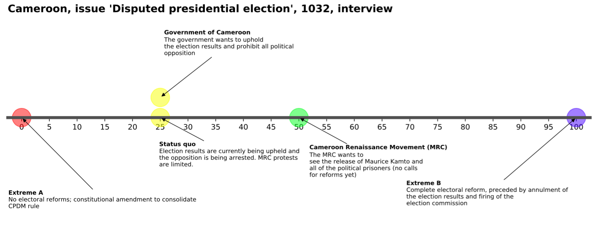

One of the goals of the expert survey I've been working on with ViEWS is to quantify the political relations between powerful stakeholders in African countries, over time. Based on a bargaining model of war, the idea is that there might be conditions in which, even though violent conflict has costly consequences, it becomes the preferred option for particular stakeholder combinations. 

Typically this is conceptualized on the level of a contested issue as space along a continuum; the extreme (ideal) situation of stakeholder `A` on the particular issue on one side, and that of `B` on the other. Ours is a variation of this: we place current preferred positions of the stakeholders along the continuum, as well as the actual status quo. While there is a lot more detail to bargaining theory, we have thus far primarily looked at changes in the distance between stakeholders, and weighing those distances with stakeholders' power and the salience of the particular contested issue to the stakeholder. The resulting data may prove effective at predicting conflict onset or escalation.

With that came the need to present this model descriptively for our cases. Here's one example output of preliminary function based on `matplotlib`:

<figure>

</figure>

Aside the straightforward plotting code (hiding the axes, centering it, etc.), the function solves some interesting problems:

1. Label placement. Given that experts often give us slightly verbose descriptions of their countries' situations, simple horizontal placement of labels tends to produce overlap. We can "repel" these labels thanks to an algorithm provided by the [adjustText](https://github.com/Phlya/adjustText) library. Virtual space is created around the axis and ticks with `patches.Rectangle()` and then passed to `add_objects` in `adjust_text()` to repel not only against labels, but also the figure itself.
2. Stakeholder positions placed at their point along 0-100 with marker `"o"` are given a color according to that value. This requires a small conversion utility using `colorsys`:
```python
def rangeval_to_hex(val, minval, maxval, start_hue=0, stop_hue=240):
    """Convert val in range to hex based on degrees in HSV colorspace.
   
    Red-blue: 0-240 by default.
    """
    h = ((val - minval) / (maxval - minval))
    h = h * (stop_hue - start_hue) + start_hue

    # hsv_to_rgb() expects h to be in 0-1.
    rgb = colorsys.hsv_to_rgb(h / 360, 1, 1)
    rgb = tuple([round(255 * x) for x in rgb])
    hex_str = "#%02x%02x%02x" % rgb
   
    return hex_str
```
3. Markers are placed along the *x*-axis, with *y* adjusted upward in cases of overlap. This is done by plotting the locations individually, each time checking if it was plotted before. If so, the `max(y)` of those previously plotted locations is taken and incremented by 1.
