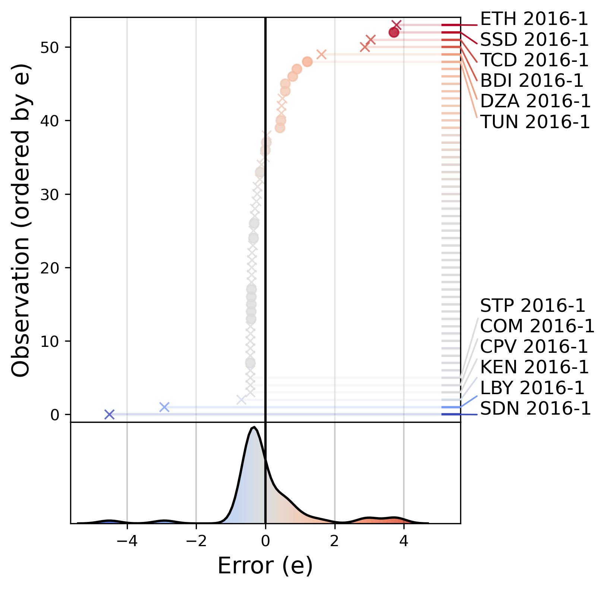
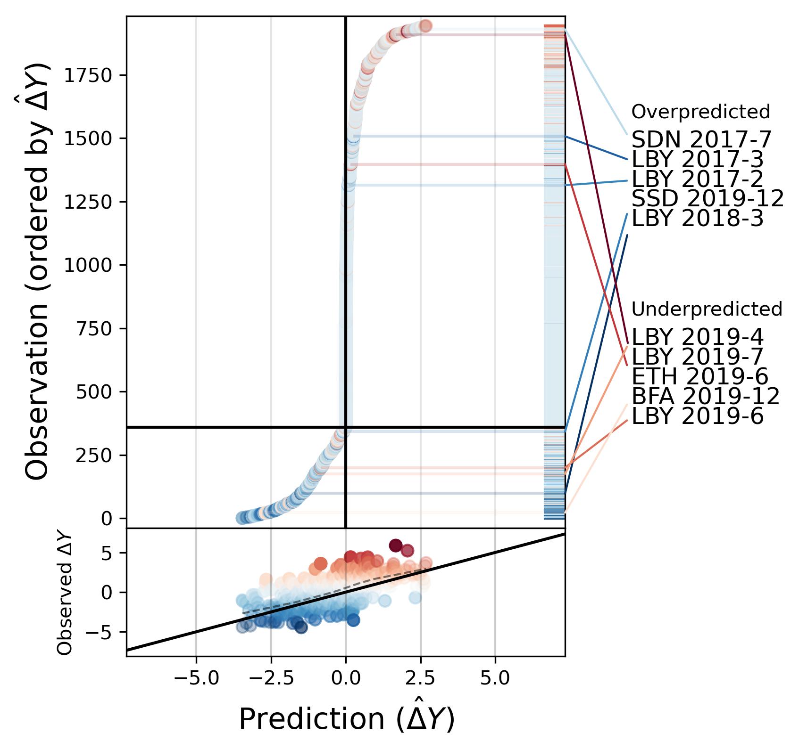

Random forest models are notoriously tricky to interpret. In order to make informed decisions in your modeling strategy, ideally you'll want to have information not just about overall performance of a model given its hyperparameters, but also: 

1. To which features this performance can be partially attributed.
2. On which types of cases or clusters of cases it performs well, and on which it does not.

This information may uncover things that were missed out on, theoretically or otherwise, when the models were specified. To address point `2`, I along with my colleagues at ViEWS have developed visualization modules based on `matplotlib` that produce what a family of what we have called "model criticism plots". 

Its Python functions simply take an (properly indexed) series of predictions, a series of observations, and a series of associated descriptive labels for the observations. For a regression problem, a simple variation we produce looks like this:

<figure>

</figure>

This achieves multiple things: 
1. Its baseline plot shows the density of negative to positive errors, thereby indicating whether the model tends to over- or underpredict, and how exactly.
2. Its scatter orders and colors observations by error, which for this particular example shows that the model produced a lot of slight underpredictions, yet a higher number of cases of significant overpredictions. We also add an alpha channel for the magnitude of the error.
3. We add a marker `x` for the cases where we predict the wrong sign. 
4. Finally, we highlight the `n` largest positive and negative errors with their labels (here limited to 2016-1). 

An alternative plotting function instead plots observations ordered by predicted value, coloring the observed value blue to red and adding an alpha channel that is determined by the magnitude of the error:

<figure>

</figure>

This setup allows us to divide our plot up into quadrants. Red dots inside the bottom-left quadrant mean that the model got the sign wrong, and vice versa for the top-right quadrant. In addition, given the length of the top-right quadrant here, the figure shows that the greater majority of predictions are above 0. Again, it displays the top `n` over- and underpredictions. 
